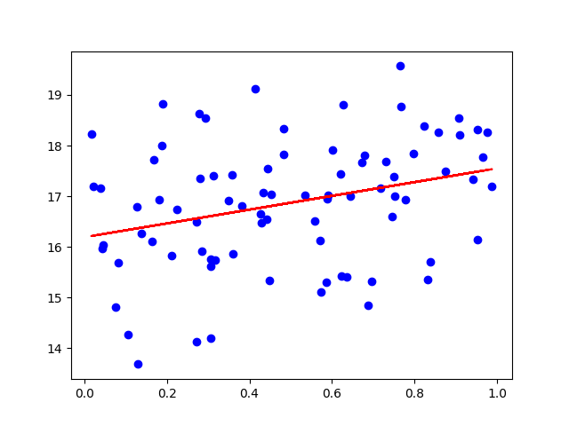
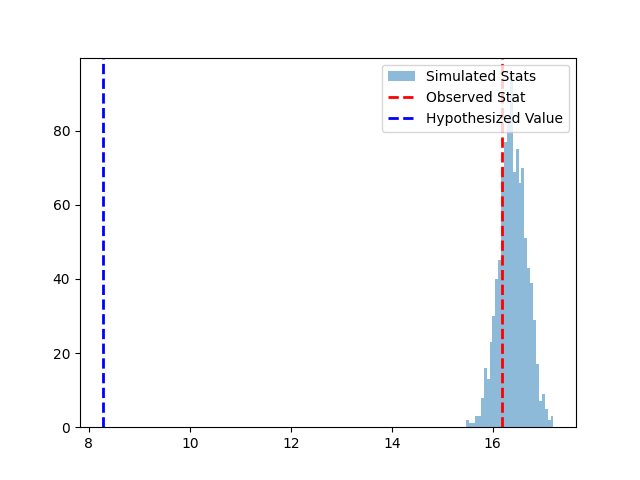
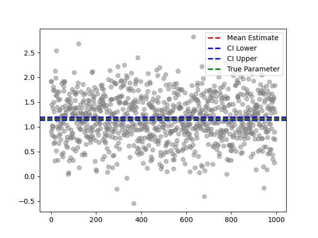

# Linear Regression Hypothesis Testing and Confidence Intervals

This project is a Flask web application that allows users to perform hypothesis testing and calculate confidence intervals for linear regression models. Users can generate data, run simulations, and visualize the results through an interactive webpage.

## Table of Contents

- [Features](#features)
- [Installation](#installation)
- [Usage](#usage)
- [Project Structure](#project-structure)
- [Screenshots](#screenshots)
- [License](#license)

## Features

- Generate random datasets based on user-specified parameters.
- Fit a linear regression model to the generated data.
- Perform hypothesis testing on the slope or intercept of the regression line.
- Calculate confidence intervals for the slope or intercept.
- Visualize the results with scatter plots, histograms, and confidence interval plots.

## Installation

1. Clone the repository:

    ```sh
    git clone https://github.com/yourusername/linear-regression-hypothesis-testing.git
    cd linear-regression-hypothesis-testing
    ```

2. Create a virtual environment and activate it:

    ```sh
    python -m venv venv
    source venv/bin/activate  # On Windows, use `venv\Scripts\activate`
    ```

3. Install the required packages:

    ```sh
    pip install -r requirements.txt
    ```

4. Run the Flask application:

    ```sh
    python app.py
    ```

5. Open your web browser and navigate to `http://127.0.0.1:5000`.

## Usage

1. **Generate Data**:
    - Fill in the form with the desired parameters:
        - Sample Size (N)
        - Mean (μ)
        - Variance (σ²)
        - Intercept (β₀)
        - Slope (β₁)
        - Number of Simulations (S)
    - Click the "Generate Data" button to generate the dataset and visualize the initial results.

2. **Hypothesis Testing**:
    - After generating data, fill in the form to specify the hypothesis test parameters:
        - Parameter to Test (Slope or Intercept)
        - Type of Test (Greater than, Less than, Not equal to)
    - Click the "Run Hypothesis Testing" button to perform the hypothesis test and visualize the results.

3. **Confidence Intervals**:
    - After generating data, fill in the form to specify the confidence interval parameters:
        - Parameter for Confidence Interval (Slope or Intercept)
        - Confidence Level (90%, 95%, 99%)
    - Click the "Calculate Confidence Interval" button to calculate and visualize the confidence interval.

## Project Structure
linear-regression-hypothesis-testing/ │ ├── app.py ├── requirements.txt ├── flask_session/ │ ├── 2029240f6d1128be89ddc32729463129 │ └── 293d12cd203270abfa81c59eeea36a23 ├── static/ │ ├── plot1.png │ ├── plot2.png │ ├── plot3.png │ └── plot4.png └── templates/ └── index.html


- `app.py`: The main Flask application file.
- `requirements.txt`: The list of required Python packages.
- `flask_session/`: Directory for storing session data.
- `static/`: Directory for storing static files (e.g., plots).
- `templates/`: Directory for storing HTML templates.

## Screenshots

### Data Generation



### Hypothesis Testing



### Confidence Intervals



## License

This project is licensed under the MIT License. See the [LICENSE](LICENSE) file for details.